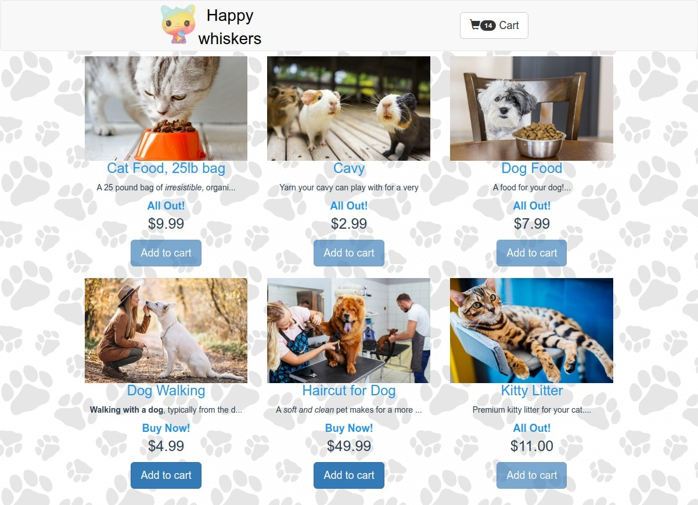
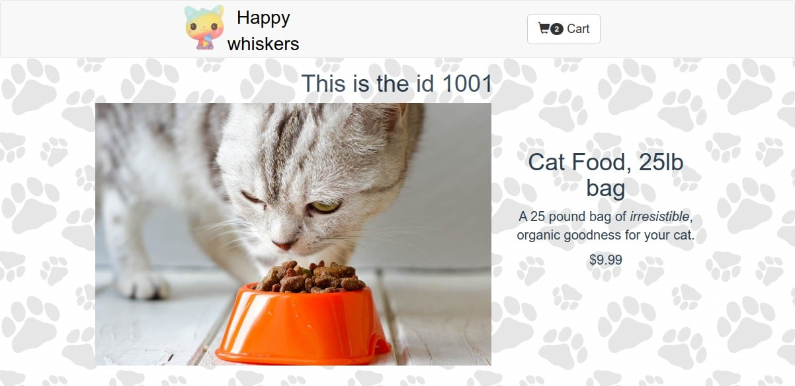
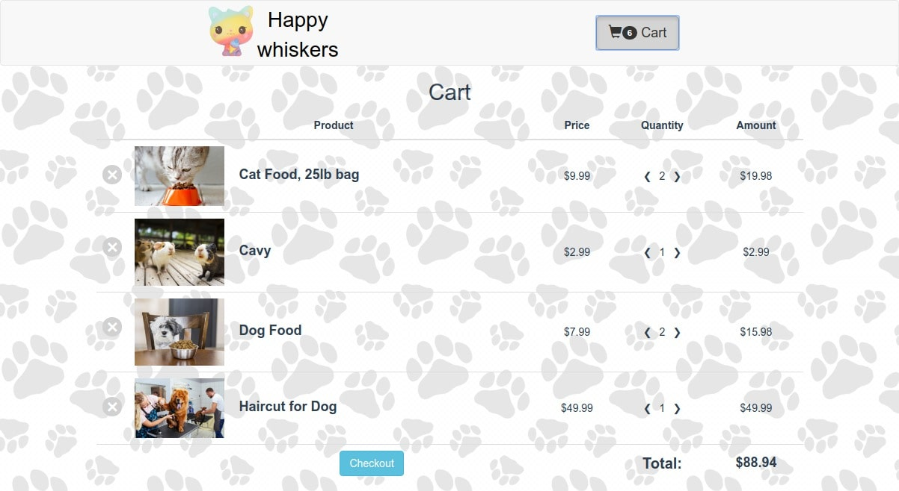
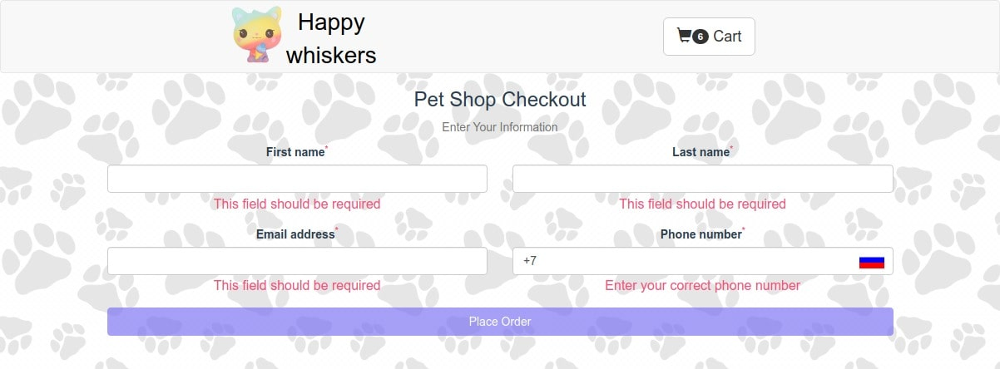

# ue Pet store

This is a simple merchandise store. On the main page, the display of the number of products in the warehouse is implemented, if the product is over, then the buy button will be blocked, if there are less than 6 items left in the warehouse, you will see a message about this.

Until no items have been added to the cart, the cart page will not be available. Implemented protection of routs from following the url link if there are no purchases in the basket.

In the basket, you can change the quantity of goods, if you reduce the quantity of goods to zero, then it will be removed from the basket.

On the page with the submit form, the data entry check is implemented.

### Install

* To start a project, you must set up all npm dependent commands.
`npm install`
* Install global `npm i -g json-server` and run server `json-server src/assets/products.json`
* All settings save to `vue.config.js`

### vue.config.js

* publicPath - basename path `http://localhost:8080/basename/` 
 

### Built With

* [axios](https://github.com/axios/axios) - Promise based HTTP client for the browser and node.js
* [vee-validate](https://github.com/logaretm/vee-validate) - validation form inputs and show to display errors
* [vue-gh-pages](https://www.npmjs.com/package/vue-gh-pages) - create a new repository with a live page on GitHub
* [vuex](https://vuex.vuejs.org/ru/) - is a predictable state container for JavaScript apps
* [vuex-persistedstate](https://github.com/robinvdvleuten/vuex-persistedstate) - Persist and rehydrate your Vuex state into `localStorage` between page reloads.
* [vue-router](https://github.com/vuejs/vue-router) - is official router for Vue.js to make building Single Page Applications
* [vue-phone-mask-input](https://www.npmjs.com/package/vue-phone-mask-input) - mask for phone numbers with validation and country identification by the entered phone number
* [vue-loader](https://github.com/vuejs/vue-loader) - animated loader templates
* [vue-fragment](https://github.com/Thunberg087/vue-fragment) - fragments are basically root-less components. They come useful in many situations where you don't want to pollute the DOM with a useless container, or you want to return many elements at once.

